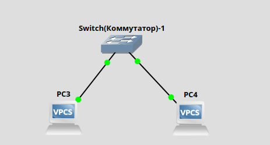
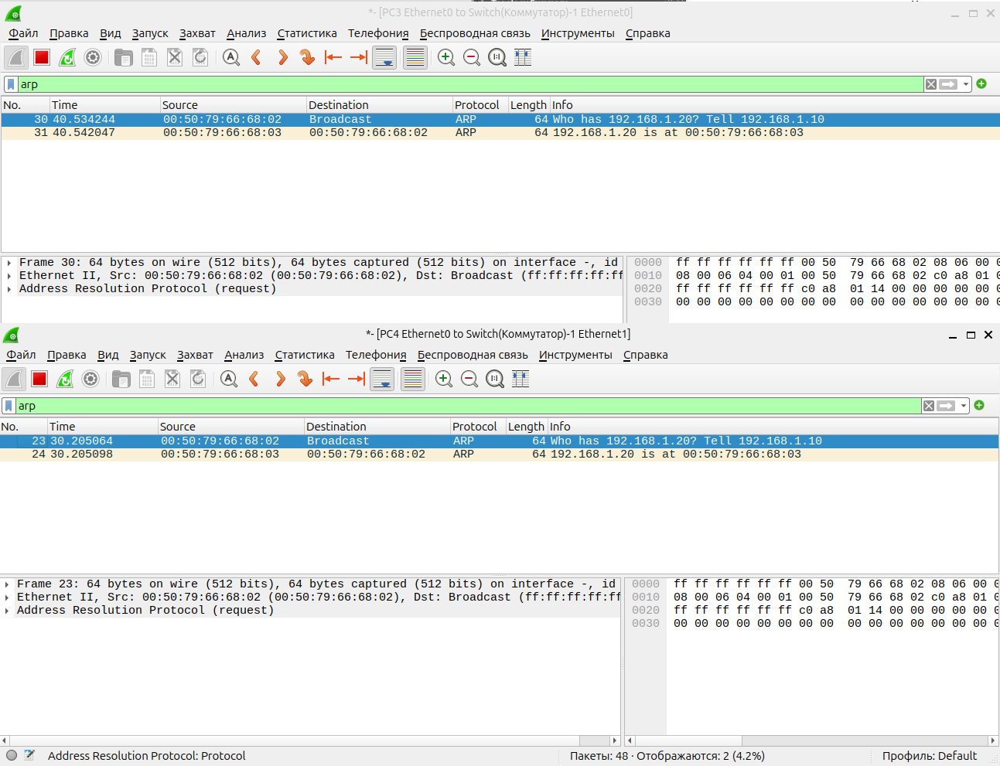
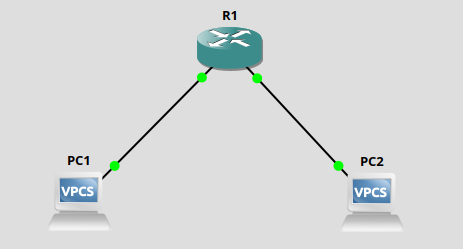
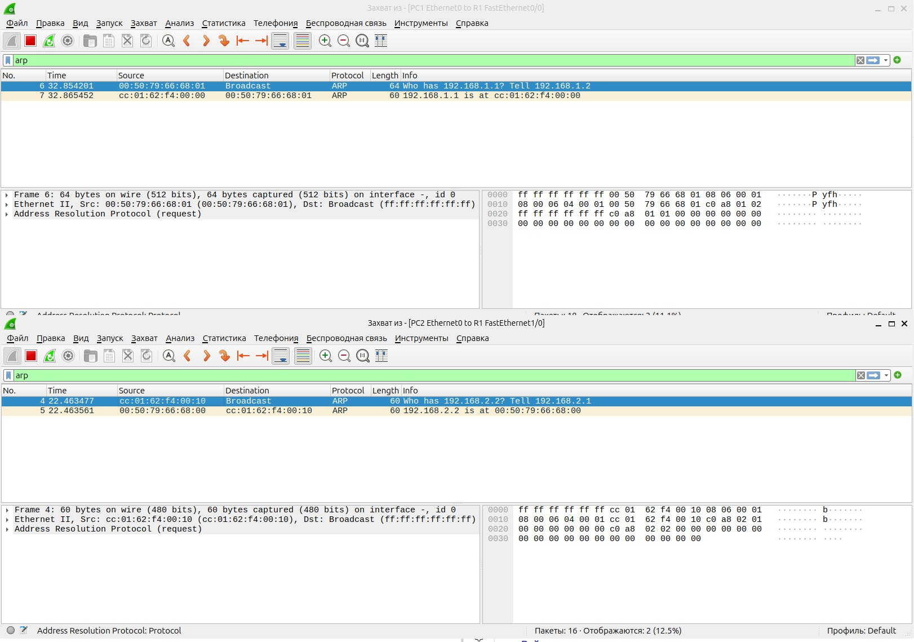
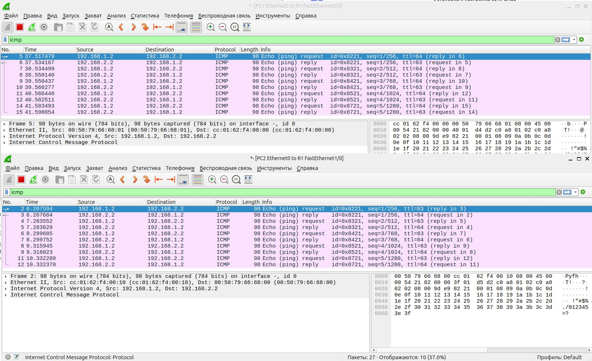

# Лабораторная работа: Настройка простой сети

## Создать простейшую сеть, состоящую из 1 коммутатора и 2 компьютеров, назначить им произвольные ip адреса из одной сети

### Первый компьютер

PC3> ip 192.168.1.10 255.255.255.0\
Checking for duplicate address...
PC3 : 192.168.1.10 255.255.255.0\

PC3> save\
Saving startup configuration to startup.vpc\
.  done

### Второй компьютер

PC4> ip 192.168.1.20 255.255.255.0\
Checking for duplicate address...
PC4 : 192.168.1.20 255.255.255.0

PC4> save\
Saving startup configuration to startup.vpc\
.  done

## Запустить симуляцию, выполнить команду ping с одного из компьютеров, используя ip адрес второго компьютера

### Выполнение ping с PC3 на PC4

PC3> ping 192.168.1.20

84 bytes from 192.168.1.20 icmp_seq=1 ttl=64 time=7.353 ms\
84 bytes from 192.168.1.20 icmp_seq=2 ttl=64 time=5.711 ms\
84 bytes from 192.168.1.20 icmp_seq=3 ttl=64 time=2.058 ms\
84 bytes from 192.168.1.20 icmp_seq=4 ttl=64 time=6.831 ms\
84 bytes from 192.168.1.20 icmp_seq=5 ttl=64 time=3.162 ms

## Перехватить трафик протокола arp на всех линках, задокументировать и проанализировать заголовки пакетов в программе Wireshark, для фильтрации трафика, относящегося к указанному протоколу использовать фильтры Wireshark

### Трафик протокола arp 

### Пакет 30 (ARP Request)

Источник: 00:50:79:66:68:02 (PC3)\
Назначение: Broadcast (ff:ff:ff:ff:ff:ff)\
Тип: ARP Request (Запрос)\
Содержание: "Кто имеет IP 192.168.1.20? Сообщите 192.168.1.10"

Анализ:
- Это стандартный ARP-запрос, отправленный в широковещательном режиме.

### Пакет 31 (ARP Reply)

Источник: 00:50:79:66:68:03 (PC4)\
Назначение: 00:50:79:66:68:02 (PC3)\
Тип: ARP Reply (Ответ)\
Содержание: "192.168.1.20 находится на MAC cc:01:62:f4:00:03"

Анализ:
- PC4 отвечает, указывая свой MAC-адрес.

### Пакеты 23 и 24 аналогичны

- Теперь PC3 знает MAC PC4 и может совершить ping.

## Создать простейшую сеть, состоящую из 1 маршрутизатора и 2 компьютеров, назначить им произвольные ip адреса из разных сетей

### Маршрутизатор

R1#enable\
R1#configure terminal\
Enter configuration commands, one per line.  End with CNTL/Z.

R1(config)#interface FastEthernet0/0\
R1(config-if)#ip address 192.168.1.1 255.255.255.0\
R1(config-if)#no shutdown\
R1(config-if)#\
*Mar  1 00:06:51.699: %LINK-3-UPDOWN: Interface FastEthernet0/0, changed state to up\
*Mar  1 00:06:52.699: %LINEPROTO-5-UPDOWN: Line protocol on Interface FastEthernet0/0, changed state to up\

R1(config-if)#exit\
R1(config)#interface FastEthernet1/0\
R1(config-if)#ip address 192.168.2.1 255.255.255.0\
R1(config-if)#no shutdown\
R1(config-if)#exit\
R1(config)#\
*Mar  1 00:07:45.971: %LINK-3-UPDOWN: Interface FastEthernet1/0, changed state to up\
*Mar  1 00:07:46.971: %LINEPROTO-5-UPDOWN: Line protocol on Interface FastEthernet1/0, changed state to up

### Первый компьютер

PC1> ip 192.168.1.2 255.255.255.0 192.168.1.1\
Checking for duplicate address...\
PC1 : 192.168.1.2 255.255.255.0 gateway 192.168.1.1

PC1> save\
Saving startup configuration to startup.vpc\
.  done

PC1> show ip

NAME        : PC1[1]\
IP/MASK     : 192.168.1.2/24\
GATEWAY     : 192.168.1.1\
DNS         : \
MAC         : 00:50:79:66:68:01\
LPORT       : 20630\
RHOST:PORT  : 127.0.0.1:20631\
MTU         : 1500

### Второй компьютер

PC2> ip 192.168.2.2 255.255.255.0 192.168.2.1\
Checking for duplicate address...\
PC2 : 192.168.2.2 255.255.255.0 gateway 192.168.2.1\

PC2> save\
Saving startup configuration to startup.vpc\
.  done

PC2> show ip

NAME        : PC2[1]\
IP/MASK     : 192.168.2.2/24\
GATEWAY     : 192.168.2.1\
DNS         : \
MAC         : 00:50:79:66:68:00\
LPORT       : 20632\
RHOST:PORT  : 127.0.0.1:20633\
MTU         : 1500

## Запустить симуляцию, выполнить команду ping с одного из компьютеров, используя ip адрес второго компьютера

### Выполнение ping с PC1 на PC2

PC1> ping 192.168.2.2

192.168.2.2 icmp_seq=1 timeout\
84 bytes from 192.168.2.2 icmp_seq=2 ttl=63 time=10.639 ms\
84 bytes from 192.168.2.2 icmp_seq=3 ttl=63 time=14.933 ms\
84 bytes from 192.168.2.2 icmp_seq=4 ttl=63 time=14.863 ms\
84 bytes from 192.168.2.2 icmp_seq=5 ttl=63 time=14.956 ms

## Перехватить трафик протокола arp и icmp на всех линках, задокументировать и проанализировать заголовки пакетов в программе Wireshark, для фильтрации трафика, относящегося к указанному протоколу использовать фильтры Wireshark

### Трафик протокола arp 

### Пакет 6 (ARP Request)

Источник: 00:50:79:66:68:01 (PC1)\
Назначение: Broadcast (ff:ff:ff:ff:ff:ff)\
Тип: ARP Request (Запрос)\
Содержание: "Кто имеет IP 192.168.1.1? Сообщите 192.168.1.2"

Анализ:
- Это стандартный ARP-запрос, отправленный в широковещательном режиме.

### Пакет 7 (ARP Reply)

Источник: cc:01:62:f4:00:00 (Router, интерфейс Fa0/0)\
Назначение: 00:50:79:66:68:01 (PC1)\
Тип: ARP Reply (Ответ)\
Содержание: "192.168.1.1 находится на MAC cc:01:62:f4:00:00"

Анализ:
- Роутер отвечает unicast-сообщением, указывая свой MAC-адрес.
- После этого PC1 сохранит запись в ARP-таблице.

### Пакет 4 (ARP Request)

Источник: cc:01:62:f4:00:10 (Router, интерфейс Fa1/0)\
Назначение: Broadcast (ff:ff:ff:ff:ff:ff)\
Тип: ARP Request (Запрос)\
Содержание: "Кто имеет IP 192.168.2.2? Сообщите 192.168.2.1"

Анализ:
- Роутер ищет MAC-адрес PC2 для пересылки ICMP-пакетов.
- Отправляется с интерфейса Fa1/0 (192.168.2.1).

### Пакет 5 (ARP Reply)

Источник: 00:50:79:66:68:00 (PC2)\
Назначение: cc:01:62:f4:00:10 (Router, интерфейс Fa1/0)\
Тип: ARP Reply (Ответ)\
Содержание: "192.168.2.2 находится на MAC 00:50:79:66:68:00"

Анализ:
- PC2 отвечает роутеру, завершая ARP-разрешение.
- Теперь роутер знает MAC PC2 и может переслать ping.

### Трафик протокола icmp

Протокол: ICMP (Echo Request/Reply)

Направление: PC1 (192.168.1.2) ↔ PC2 (192.168.2.2)

Размер пакетов: 98 байт (стандартный размер ping-запросов)

TTL (Time To Live):\
Исходный TTL = 64 (уменьшается на 1 при прохождении маршрутизатора)

На PC1 запросы отправляются с TTL=64, ответы приходят с TTL=63.\
На PC2 запросы приходят с TTL=63, ответы отправляются с TTL=64.

id - (Identifier)	Уникальный идентификатор сессии ping (0x8221, 0x8321 и т.д.)

seq - (Sequence)	Номер последовательности в сессии (1/256, 1/512 и т.д.)

TTL	- Время жизни пакета. Уменьшается на 1 при прохождении через маршрутизатор.

request/reply - Тип пакета: запрос (Echo Request) или ответ (Echo Reply).

### Пример сессии с id=0x8221

1. Запрос от PC1 (No.5):

Source: 192.168.1.2 → Destination: 192.168.2.2

TTL=64 (отправлен с PC1)

id=0x8221, seq=1/256

2. Ответ от PC2 (No.6):

Source: 192.168.2.2 → Destination: 192.168.1.2

TTL=63 (прошел через маршрутизатор)

id=0x8221, seq=1/256 (совпадает с запросом)

Наблюдения:

- Каждому запросу соответствует ответ с тем же id и seq.
- TTL в ответах на PC1 уменьшен на 1 (63), так как пакет прошел через маршрутизатор.
- На PC2 запросы приходят с TTL=63, а ответы отправляются с TTL=64.