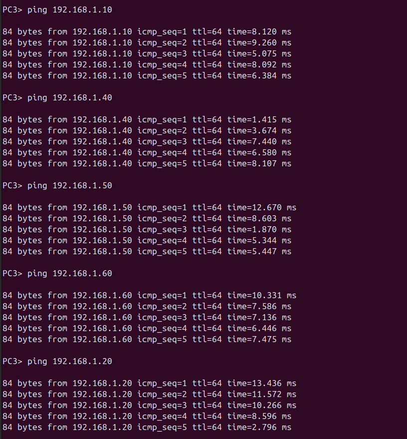

# Лабораторная работа: Настройка протокола STP (IEEE 802.1D)

## Для заданной на схеме schema-lab2 сети, состоящей из управляемых коммутаторов и персональных компьютеров настроить протокол STP, назначив явно один из коммутаторов корневым настройкой приоритета

### Первый коммутатор

vIOS-L2-01>enable\
vIOS-L2-01#configure terminal\
Enter configuration commands, one per line.  End with CNTL/Z.\
vIOS-L2-01(config)#spanning-tree vlan 1 priority 4096\
vIOS-L2-01(config)#exit\
vIOS-L2-01#\
*Aug 16 11:09:53.376: %SYS-5-CONFIG_I: Configured from console by console\
vIOS-L2-01#show spanning-tree

#### VLAN0001
Spanning tree enabled protocol ieee\
Root ID\ 
Priority    4097\
Address     0c96.9efd.0000\
This bridge is the root\
Hello Time   2 sec  Max Age 20 sec  Forward Delay 15 sec

Bridge ID\
Priority    4097   (priority 4096 sys-id-ext 1)\
Address     0c96.9efd.0000\
Hello Time   2 sec  Max Age 20 sec  Forward Delay 15 sec\
Aging Time  300 sec

Interface           Role Sts Cost      Prio.Nbr Type\
------------------- ---- --- --------- -------- --------------------------------\
Gi0/0               Desg FWD 4         128.1    Shr \
Gi0/1               Desg FWD 4         128.2    Shr \
Gi0/2               Desg FWD 4         128.3    Shr \
Gi0/3               Desg FWD 4         128.4    Shr \
Gi1/0               Desg FWD 4         128.5    Shr \
Gi1/1               Desg FWD 4         128.6    Shr \
Gi1/2               Desg FWD 4         128.7    Shr \
Gi1/3               Desg FWD 4         128.8    Shr \
Gi2/0               Desg FWD 4         128.9    Shr 

        
#### VLAN0100  
Spanning tree enabled protocol ieee\
Root ID    \
Priority    32868\
Address     0c96.9efd.0000\
This bridge is the root\
Hello Time   2 sec  Max Age 20 sec  Forward Delay 15 sec
          
Bridge ID  \
Priority    32868  (priority 32768 sys-id-ext 100)\
Address     0c96.9efd.0000\
Hello Time   2 sec  Max Age 20 sec  Forward Delay 15 sec\
Aging Time  300 sec
          
Interface           Role Sts Cost      Prio.Nbr Type\
------------------- ---- --- --------- -------- --------------------------------\
Gi0/0               Desg FWD 4         128.1    Shr \
Gi0/1               Desg FWD 4         128.2    Shr \
Gi0/2               Desg FWD 4         128.3    Shr \
Gi0/3               Desg FWD 4         128.4    Shr 

#### VLAN0200  
Spanning tree enabled protocol ieee\
Root ID    \
Priority    32968\
Address     0c96.9efd.0000\
This bridge is the root\
Hello Time   2 sec  Max Age 20 sec Forward Delay 15 sec
          
Bridge ID  \
Priority    32968  (priority 32768 sys-id-ext 200)\
Address     0c96.9efd.0000\
Hello Time   2 sec  Max Age 20 sec Forward Delay 15 sec\
Aging Time  300 sec
          
Interface           Role Sts Cost      Prio.Nbr Type\
------------------- ---- --- --------- -------- --------------------------------\
Gi0/0               Desg FWD 4         128.1    Shr \
Gi0/1               Desg FWD 4         128.2    Shr \
Gi0/2               Desg FWD 4         128.3    Shr \
Gi0/3               Desg FWD 4         128.4    Shr 
              

#### VLAN0300  
Spanning tree enabled protocol ieee\
Root ID   \ 
Priority    33068\
Address     0c96.9efd.0000\
This bridge is the root\
Hello Time   2 sec  Max Age 20 sec  Forward Delay 15 sec
          
Bridge ID  \
Priority    33068  (priority 32768 sys-id-ext 300)\
Address     0c96.9efd.0000\
Hello Time   2 sec  Max Age 20 sec  Forward Delay 15 sec\
Aging Time  300 sec
          
Interface           Role Sts Cost      Prio.Nbr Type\
------------------- ---- --- --------- -------- --------------------------------\
Gi0/0               Desg FWD 4         128.1    Shr \
Gi0/1               Desg FWD 4         128.2    Shr \
Gi0/2               Desg FWD 4         128.3    Shr \
Gi0/3               Desg FWD 4         128.4    Shr 
        
## Проверить доступность каждого с каждым всех персональных компьютеров (VPCS), результаты запротоколировать

### Настройка IP-адресов

PC1> ip 192.168.1.10\
Checking for duplicate address...\
PC1 : 192.168.1.10 255.255.255.0

PC1> save\
Saving startup configuration to startup.vpc\
.  done

PC2> ip 192.168.1.20\
Checking for duplicate address...\
PC2 : 192.168.1.20 255.255.255.0

PC2> save\
Saving startup configuration to startup.vpc\
.  done

PC3> ip 192.168.1.30\
Checking for duplicate address...\
PC3 : 192.168.1.30 255.255.255.0

PC3> save\
Saving startup configuration to startup.vpc\
.  done

PC4> ip 192.168.1.40\
Checking for duplicate address...\
PC4 : 192.168.1.40 255.255.255.0

PC4> save\
Saving startup configuration to startup.vpc\
.  done

PC5> ip 192.168.1.50\
Checking for duplicate address...\
PC5 : 192.168.1.50 255.255.255.0

PC5> save\
Saving startup configuration to startup.vpc\
.  done

PC6> ip 192.168.1.60\
Checking for duplicate address...\
PC6 : 192.168.1.60 255.255.255.0

PC6> save\
Saving startup configuration to startup.vpc\
.  done

### Проверка ping
#### Первый компьютер

#### Второй компьютер

#### Третий компьютер

#### Четвёртый компьютер

#### Пятый компьютер

#### Шестой компьютер

## На изображении схемы отметить BID каждого коммутатора и режимы работы портов (RP/DP/blocked) и стоимости маршрутов, результат сохранить в файл

## При помощи wireshark отследить передачу пакетов hello от корневого коммутатора на всех линках, результаты включить в отчет

### Пакеты на Layer2Switch-1_Ethernet0_to_Layer2Switch-2_Ethernet0

### Пакеты на Layer2Switch-1_Ethernet1_to_Layer2Switch-2_Ethernet1

### Пакеты на Layer2Switch-1_Ethernet2_to_Layer2Switch-3_Ethernet0

### Пакеты на Layer2Switch-1_Ethernet3_to_Layer2Switch-3_Ethernet1

### Пакеты на Layer2Switch-1_Ethernet4_to_Layer2Switch-4_Ethernet0

### Пакеты на Layer2Switch-1_Ethernet5_to_Layer2Switch-4_Ethernet1

### Пакеты на Layer2Switch-1_Ethernet6_to_Layer2Switch-5_Ethernet0

### Пакеты на Layer2Switch-1_Ethernet7_to_Layer2Switch-5_Ethernet1

## Изменить стоимость маршрута для порта RP произвольного назначенного (designated) коммутатора, повторить действия из п.3, результат сохранить в отдельный файл

vIOS-L2-01(config)#interface Gi0/0\
vIOS-L2-01(config-if)#spanning-tree cost 30

vIOS-L2-01#show spanning-tree

VLAN0001\
Spanning tree enabled protocol ieee\
Root ID    \
Priority    4097\
Address     0c44.6f9b.0000\
Cost        4\
Port        2 (GigabitEthernet0/1)\
Hello Time   2 sec  Max Age 20 sec  Forward Delay 15 sec

Bridge ID  \
Priority    32769  (priority 32768 sys-id-ext 1)\
Address     0cb5.0fc8.0000\
Hello Time   2 sec  Max Age 20 sec  Forward Delay 15 sec\
Aging Time  300 sec

Interface           Role Sts Cost      Prio.Nbr Type\
------------------- ---- --- --------- -------- --------------------------------\
Gi0/0               Altn BLK 30        128.1    Shr \
Gi0/1               Root FWD 4         128.2    Shr \
Gi0/2               Altn BLK 4         128.3    Shr \
Gi0/3               Altn BLK 4         128.4    Shr \
Gi1/0               Desg FWD 4         128.5    Shr \
Gi1/1               Desg FWD 4         128.6    Shr \
Gi1/2               Desg FWD 4         128.7    Shr \
Gi1/3               Desg FWD 4         128.8    Shr \
Gi2/0               Desg FWD 4         128.9    Shr 
          
### Изменился Root port из-за стоимости

## Сохранить файлы конфигураций устройств в виде набора файлов с именами, соответствующими именам устройств

vIOS-L2-01>enable\
vIOS-L2-01#show running-config
### Всё хранится в файлах: Layer2Switch-N.conf
